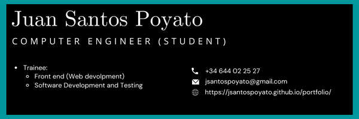

# KNOW ABOUT ME

## 🔭 I’m currently working on ...

- [ ] Growing as a Web and Software developer
- [ ] Become a senior at JavaScript (including EcmaScript - ES6)
- [ ] Learn more about testing and QA
- [ ] Develop my knowledge and put in in practice in agile methodologies (Scrum and Kanban)

## 📈 GitHub Stats 

## ⌨️ Languages 

## ‍💻 Tech stack and knowledge ...

### Languages:
C,

, HTML 5, CSS3, SQL.

### Stack:
| Technologies                                                                                        | Programming     | Software             | Computers            | Engineering        |
|-----------------------------------------------------------------------------------------------------|-----------------|----------------------|----------------------|--------------------|
|  | Data Structures | Data Bases           | Networks and Servers | Mathematics        |
| Virtual Machines                                                                                    | Clean Coding    | Web Mining           | Cibersecurity        | Algorithm Design   |
| IDEs                                                                                                | Reusability     | NLP                  | Operating Systems    | Project Management |
|                                                                                                     | UML             | Software development | Comp. Graphics       | Workflows          |
|                                                                                                     | OOP             | Web Development      | Embedded Systems     |                    |
|                                                                                                     |                 | Testing              | CPI                  |                    |

## 👯 Soft Skills ...

- Creative
- Communicative
- Easy-to-talk-to
- Teamworker
- Self-critical and thoughful
- Curious
- Flexible
- Honest
- High sense of humour

## 🤔 I’m looking for help with ...

Any code review of my projects is welcomed!

## 💬 Ask me about ...

Anything, I will try to answer as soon as possible!

## 📫 How to reach me: ...

You can reach me on the twitter or linkedin on my profile, gmail or phone in the number in the banner above.

## ⚡ Fun fact:

Did you know that the fastest way to loop on Python is not Looping at all? (Use math or numpy methods when you can!)
